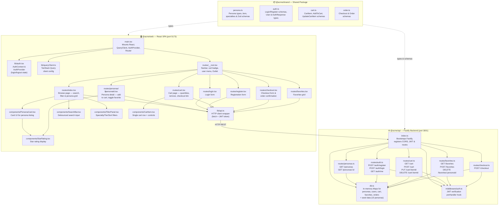

# Agentic Personas Storefront — Architecture Overview

## High-Level Overview

This is an **"Agentic Personas Storefront"** — a full-stack e-commerce app for browsing and purchasing fictional AI agent personas. It's built as a **Turborepo monorepo** with three packages:

---

## End-to-End Architecture Diagram

---

## Module-by-Module ELI5

### `@acme/shared` — The Shared Dictionary

> *"The rulebook everyone agrees on."*

| File | What it does (ELI5) |
|---|---|
| **persona.ts** | Defines what an AI persona looks like (name, price, tier, specialty, rating) and what filters you can use to search them. Like a product spec sheet. |
| **auth.ts** | Defines the shape of login/register forms and what a "user" looks like. The bouncer's checklist. |
| **cart.ts** | Defines what a shopping cart item looks like and what info you need to add/update one. |
| **order.ts** | Defines what a completed order looks like after checkout. The receipt format. |

### `@acme/api` — The Backend (Fastify, port 3001)

> *"The shop's warehouse and cash register."*

| File | What it does (ELI5) |
|---|---|
| **index.ts** | Starts the server, enables CORS for the frontend, sets up JWT auth, and plugs in all the route handlers. The "open for business" switch. |
| **db.ts** | An in-memory fake database using JavaScript Maps. Pre-loads 15 seed personas. Provides CRUD helpers for personas, users, cart, favorites, and orders. Think of it as a spreadsheet in RAM. |
| **middleware/auth.ts** | Checks if a user's JWT token is valid before letting them hit protected routes. The security guard at the door. |
| **routes/personas.ts** | Lets anyone browse personas with search/filter/sort, or view a single persona by ID. The product catalog. |
| **routes/auth.ts** | Handles sign-up, login (returns a JWT token), and "who am I?" checks. The front desk / ID counter. |
| **routes/cart.ts** | Lets logged-in users add personas to their cart, change quantities, or remove items. The shopping basket handler. |
| **routes/favorites.ts** | Lets users save/unsave personas they like. The wishlist manager. |
| **routes/checkout.ts** | Takes the cart, creates an order record, and returns a confirmation. The cashier. |

### `@acme/web` — The Frontend (React SPA, port 5173)

> *"The storefront window and shopping experience."*

| File | What it does (ELI5) |
|---|---|
| **main.tsx** | Wires everything together — React, the query cache, auth state, and the router. The "turn on the lights" file. |
| **lib/api.ts** | A small HTTP helper that attaches the user's JWT token to every request. The messenger between frontend and backend. |
| **lib/auth.tsx** | Keeps track of whether you're logged in and who you are, using React Context. The "remember me" system. |
| **lib/queryClient.ts** | Configures TanStack Query (data caching, retries, staleness). The smart cache layer. |
| **routes/__root.tsx** | The persistent navbar with logo, Browse/Favorites links, cart badge with item count, and sign-in/sign-out buttons. The top bar you always see. |
| **routes/index.tsx** | The main browse page — search bar, specialty/tier/sort filters, and a grid of persona cards. The shop floor. |
| **routes/personas/$personaId.tsx** | Detailed view of a single persona — description, capabilities, add-to-cart, and favorite toggle. The product page. |
| **routes/login.tsx** / **register.tsx** | Login and registration forms. The sign-in / sign-up doors. |
| **routes/cart.tsx** | Shows cart items with quantity controls, per-item pricing, total, and a "Proceed to Checkout" button. The shopping cart view. |
| **routes/checkout.tsx** | Collects name/email, shows order summary, places the order, and shows confirmation. The checkout counter. |
| **routes/favorites.tsx** | Grid of favorited personas with remove buttons. Your wishlist page. |
| **components/** | Reusable UI pieces: `PersonaCard` (product tile), `SearchBar` (debounced input), `FilterPanel` (sidebar filters), `CartItem` (cart row), `StarRating` (star display). |

---

## End-to-End User Flow

1. **Browse** → User lands on `/`, frontend fetches `GET /personas` with optional query params
2. **View Detail** → Click a card → `/personas/:id`, fetches `GET /personas/:id`
3. **Register/Login** → `/register` or `/login` → `POST /auth/register` or `POST /auth/login` → receives JWT token stored in `localStorage`
4. **Add to Cart** → On detail page, click "Add to Cart" → `POST /cart` (JWT required)
5. **Favorite** → Toggle heart button → `POST /favorites` or `DELETE /favorites/:id`
6. **Review Cart** → `/cart` → `GET /cart` → adjust quantities (`PUT /cart/:itemId`) or remove (`DELETE /cart/:itemId`)
7. **Checkout** → `/checkout` → `POST /checkout` with name + email → order created, cart cleared, confirmation shown
